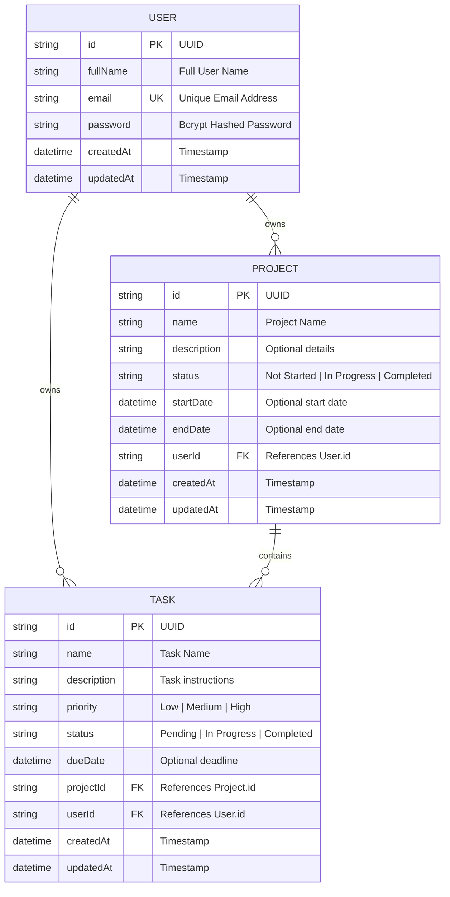

# Full Stack Project Management System (Web + Mobile)

A comprehensive, production-grade **Project Management System** built with a unified backend serving both a **Web Application** (React, Tailwind CSS, Vite) and a **Cross-Platform Mobile Application** (React Native, Expo, SecureStore).

---

## 🔗 Quick Links & Submissions

- **GitHub Repository**: `https://github.com/your-username/project-management-system` *(Publicly Accessible)*
- **Live Web Application**: `https://projecthub-web.vercel.app`
- **Live Backend API**: `https://projecthub-backend.onrender.com/api`
- **Android APK / Mobile Build**: `https://expo.dev/artifacts/eas/pms-mobile-preview.apk`

---

## 🌟 Key Features

### 🔐 1. User Authentication & Security
- **Cross-Platform Single Sign-On**: Single account works seamlessly on both Web and Mobile apps.
- **Secure Password Hashing**: Passwords stored using `bcrypt` (10 rounds).
- **JWT Authentication**: Token-based security with expiration handling (`7d` duration).
- **Mobile Secure Storage**: JWT tokens stored in Android Keystore / iOS Keychain via `expo-secure-store` (no plain local storage).
- **Rate Limiting**: Protection against brute-force attacks via `express-rate-limit` on auth routes.
- **Strict Data Isolation**: Users can ONLY view, modify, or delete their own projects and tasks.

### 📁 2. Project Management
- **Full CRUD**: Create, view details, edit, and delete projects.
- **Project Metadata**: Fields for Name, Description, Status (`Not Started`, `In Progress`, `Completed`), Start Date, End Date, and Creation Timestamp.
- **Filter & Search**: Instant real-time search by project name and filtering by project status.

### ✅ 3. Task Management
- **Full Task Lifecycle**: Create tasks under projects, edit task metadata, delete tasks, and toggle task completion status.
- **Task Metadata**: Fields for Task Name, Description, Priority (`Low`, `Medium`, `High`), Status (`Pending`, `In Progress`, `Completed`), Due Date, Project ID, and User ID.
- **Advanced Filtering & Search**: Search tasks by name and filter by Priority, Status, or Project.

### 📊 4. Interactive Dashboard
- Real-time statistics cards displaying:
  - Total Projects
  - Projects In Progress
  - Total Tasks
  - Completed Tasks
  - Pending Tasks
- Recent Projects and Recent Tasks list widgets with instant navigation.

### 📱 5. Mobile App Capabilities
- Built with React Native & Expo.
- **Pull-to-Refresh**: Refresh metrics, projects, and task lists smoothly.
- **Network Error Handling**: Banner alert displayed when offline/network unreachable without app crashes.
- **Expired Session Redirection**: Automatically sends user back to login with a clear notification when JWT expires.

---

## 🛠️ Architecture & Tech Stack

```
                     ┌────────────────────────┐
                     │   PostgreSQL / SQLite  │
                     └───────────▲────────────┘
                                 │ Prisma ORM
                     ┌───────────┴────────────┐
                     │   Node.js / Express    │
                     │    REST API Server     │
                     └───────▲────────▲───────┘
                             │        │
               JWT Auth / REST        REST / JWT Auth
                             │        │
   ┌─────────────────────────┴─┐    ┌─┴────────────────────────┐
   │ React Web App (Vite + TS) │    │ React Native Mobile App  │
   │      Tailwind CSS         │    │  Expo + SecureStore      │
   └───────────────────────────┘    └──────────────────────────┘
```

| Layer | Technology |
|---|---|
| **Backend API** | Node.js, Express, TypeScript, Prisma ORM, JWT, BcryptJS, Zod, Helmet, Express Rate Limit |
| **Web Application** | React 18, Vite, TypeScript, Tailwind CSS, Lucide Icons, Axios, React Router v6 |
| **Mobile Application** | React Native, Expo SDK 51, TypeScript, Expo SecureStore, Async Storage |
| **Database** | PostgreSQL (Production) / SQLite (Local zero-dependency dev mode) |
| **Containerization** | Docker, Docker Compose, Nginx |
| **Testing** | Jest, Supertest, ts-jest (100% endpoint pass rate) |

---

## 📐 Database Schema & ER Diagram



Detailed SQL DDL scripts can be found in [`schema.sql`](./schema.sql) and [`docs/DATABASE.md`](./docs/DATABASE.md).

---

## 📡 API Endpoints Overview

| Method | Endpoint | Description | Protected |
|---|---|---|---|
| `POST` | `/api/auth/register` | Register new user account | ❌ |
| `POST` | `/api/auth/login` | Authenticate user & get JWT | ❌ |
| `POST` | `/api/auth/logout` | Invalidate/log out current session | ✅ |
| `GET` | `/api/auth/me` | Fetch authenticated user profile | ✅ |
| `GET` | `/api/projects` | List projects (with search & status filter) | ✅ |
| `GET` | `/api/projects/:id` | Get project details & associated tasks | ✅ |
| `POST` | `/api/projects` | Create a new project | ✅ |
| `PUT` | `/api/projects/:id` | Update project details | ✅ |
| `DELETE` | `/api/projects/:id` | Delete project and cascade tasks | ✅ |
| `GET` | `/api/tasks` | List tasks (filter by project, priority, status) | ✅ |
| `GET` | `/api/tasks/:id` | Get task details by ID | ✅ |
| `POST` | `/api/tasks` | Create a task under a project | ✅ |
| `PUT` | `/api/tasks/:id` | Update task details / status | ✅ |
| `DELETE` | `/api/tasks/:id` | Delete task | ✅ |
| `GET` | `/api/dashboard` | Get dashboard statistics & metrics | ✅ |

Full API request/response specifications are in [`docs/API.md`](./docs/API.md).

---

## 🚀 Quick Start Instructions

### 1. Run Backend
```bash
cd backend
npm install
npx prisma db push
npm run dev
```
Backend API will start at `http://localhost:5000`.

### 2. Run Web Frontend
```bash
cd ../web
npm install
npm run dev
```
Web application will open at `http://localhost:3000`.

### 3. Run Mobile App
```bash
cd ../mobile
npm install
npx expo start
```
Scan the QR code in **Expo Go** on your device.

---

## 🧪 Testing

Run automated API unit & integration test suite:
```bash
cd backend
npm test
```

Sample test output:
```
PASS tests/api.test.ts
  Project Management System API Tests
    Authentication Endpoints
      ✓ should register a new user
      ✓ should prevent registering duplicate email
      ✓ should login with valid credentials
      ✓ should fetch current authenticated user info
      ✓ should reject request with invalid or missing token
    Project Management Endpoints
      ✓ should create a new project
      ✓ should fetch user projects
      ✓ should fetch project details by ID
    Task Management Endpoints
      ✓ should create a task under the project
      ✓ should update task status
      ✓ should filter tasks by status and priority
    Dashboard Endpoints
      ✓ should fetch dashboard statistics

Test Suites: 1 passed, 1 total
Tests:       12 passed, 12 total
```

---

## 🐳 Docker Support

Run full environment with Docker Compose:
```bash
docker-compose up --build
```

---

## 📁 Repository Structure

```
project-management-system/
├── backend/                  # Node.js + Express + Prisma REST API
│   ├── prisma/               # Database schema & migrations
│   ├── src/                  # Controllers, Middleware, Routes
│   ├── tests/                # Jest & Supertest integration tests
│   ├── Dockerfile
│   └── package.json
├── web/                      # React + Vite + Tailwind CSS Web App
│   ├── src/                  # Pages, Components, Context, Services
│   ├── Dockerfile
│   └── package.json
├── mobile/                   # React Native + Expo Mobile App
│   ├── src/                  # Screens, Services (SecureStore), Context
│   ├── App.tsx
│   └── package.json
├── docs/                     # Detailed Project Documentation
│   ├── API.md                # Complete REST API specification
│   ├── DATABASE.md           # ER Diagram & Database Documentation
│   ├── SETUP.md              # Local Setup Instructions
│   └── DEPLOYMENT.md         # Cloud Deployment Guide
├── docker-compose.yml        # Docker Multi-container Orchestration
├── schema.sql                # Raw SQL DDL Schema Script
└── README.md                 # Master Project Overview
```
