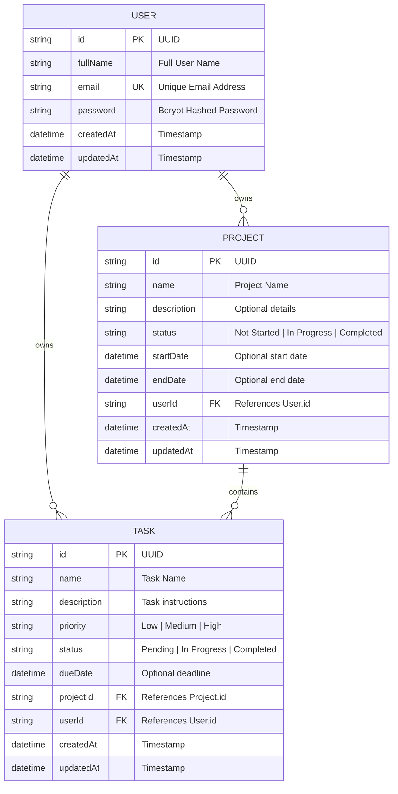

# Project Management System - Database Documentation & ER Diagram

## Entity Relationship (ER) Diagram

---

## Database Schemas & Tables

### 1. `users` Table
Stores registered accounts.
- `id` (VARCHAR / UUID, PRIMARY KEY): Unique identifier.
- `fullName` (VARCHAR, NOT NULL): User's full name.
- `email` (VARCHAR, UNIQUE, NOT NULL): Unique login email.
- `password` (VARCHAR, NOT NULL): Bcrypt password hash.
- `createdAt` (TIMESTAMP, DEFAULT CURRENT_TIMESTAMP).
- `updatedAt` (TIMESTAMP, AUTO UPDATE).

### 2. `projects` Table
Stores user projects.
- `id` (VARCHAR / UUID, PRIMARY KEY).
- `name` (VARCHAR, NOT NULL): Name of project.
- `description` (TEXT, NULLABLE).
- `status` (VARCHAR, DEFAULT 'Not Started'): Check constraint `('Not Started', 'In Progress', 'Completed')`.
- `startDate` (TIMESTAMP, NULLABLE).
- `endDate` (TIMESTAMP, NULLABLE).
- `userId` (VARCHAR, FOREIGN KEY -> `users.id`, ON DELETE CASCADE).
- `createdAt` (TIMESTAMP).
- `updatedAt` (TIMESTAMP).

### 3. `tasks` Table
Stores task action items under projects.
- `id` (VARCHAR / UUID, PRIMARY KEY).
- `name` (VARCHAR, NOT NULL).
- `description` (TEXT, NULLABLE).
- `priority` (VARCHAR, DEFAULT 'Medium'): Check constraint `('Low', 'Medium', 'High')`.
- `status` (VARCHAR, DEFAULT 'Pending'): Check constraint `('Pending', 'In Progress', 'Completed')`.
- `dueDate` (TIMESTAMP, NULLABLE).
- `projectId` (VARCHAR, FOREIGN KEY -> `projects.id`, ON DELETE CASCADE).
- `userId` (VARCHAR, FOREIGN KEY -> `users.id`, ON DELETE CASCADE).
- `createdAt` (TIMESTAMP).
- `updatedAt` (TIMESTAMP).
